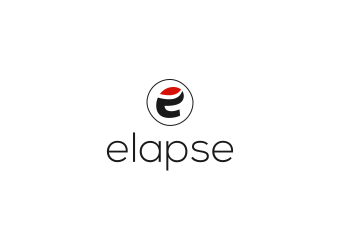

<h2 align="center"></h2>

> 流水衷曲，韶华飞逝

此项目不再更新，推荐查看重构后的新项目[plarum](https://github.com/justemit/plarum)。

前后端分离 + 服务端渲染的博客系统。其中：

- 接口服务使用 Koa2 + mongodb + mongoose
- 后端管理使用 Vue 开发
- 前端页面使用 React 服务端渲染框架`nextjs`

本项目比较简单，一定程度上适合入门。您可以学到如何使用`koa2`开发接口和如何使用`vue`开发单页面。

## 0. 如何运行

### 0.1 运行接口服务

打开 `server` 项目修改 `server/config` 下的相关配置，尤其是 `mongodb` 的配置，然后运行 `npm run dev` 即可

### 0.2 运行后台系统

进入 `be` 项目，安装依赖后执行 `npm run dev`，然后打开浏览器相关链接即可

### 0.3 运行前台页面

进入 `fe` 项目，安装依赖后执行 `npm run dev`，然后打开浏览器相关链接即可

## 1. 效果预览

### 1.1 后端管理页面

后端管理页面使用了 vue、vuex、sass 以及 axios，其中模仿 ElementUI 的样式开发了`dialog`、`loading`、`confirm`、`notofication`、`messgae`等等组件，（感觉自己对 vue 组件的开发姿势又稍微深入了一点点，毕竟学无止境）。以下为部分页面截图：

  <ul>
    <li>
      
登录预览

      
    </li>
    <li>
      
个人中心

      
    </li>
    <li>
      
文章管理

      
    </li>
  </ul>

### 1.2 前台页面渲染

借此机会想学习一下`React`，于是前端页面使用了 React 服务端渲染框架`nextjs`，并使用了`Redux`、`axios`以及`koa`(自定义服务所用)。前端页面目前比较简单，主要就是文章的读取和渲染。

## 2. 笔记总结

### 2.1 Vue.js 篇

- [Vue 组件开发总结](./docs/Vue组件开发姿势总结.md)
- [利用 Promise 做表单验证](./docs/表单验证.md)
- [上传组件开发以及上传到七牛云](./docs/上传组件.md)

### 2.2 Koa2 篇

- [一文入门 koa2 接口开发](./docs/koa2接口开发.md)
- [使用 koa2 签发认证 token](./docs/jwt签发与认证.md)
- [使用 log4js 为 koa2 增加日志记录](./docs/日志中间件.md)

### 2.3 部署篇

- [页面部署与接口服务](./docs/页面部署与接口服务.md)
